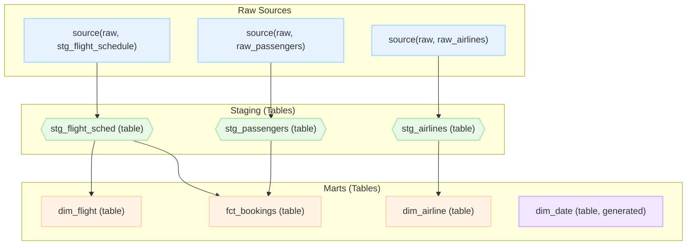

# Flight Data Analytics Project

This dbt project is designed to transform raw flight, passenger, and airline data from the `raw` schema into a clean, structured data mart (`marts`). The mart is designed as a star schema, ready for use in BI tools (like Looker, Tableau, or Power BI).

## Tech Stack

* **Transformation:** dbt (data build tool)
* **Data Warehouse:** Google BigQuery (inferred from the `CREATE OR REPLACE TABLE` and `GENERATE_DATE_ARRAY` syntax)

---

## Model Structure

The project follows standard dbt methodology, separating models into layers:

### 1. Sources

Data is ingested from the `raw` schema (presumably `flight_to_2026.raw`):
* `stg_flight_schedule`: Flight schedules, including actual and planned times.
* `raw_passengers`: Booking information, including `booking_id`, `flight_id`, and ticket price.
* `raw_airlines`: Airline lookup table.

### 2. Staging Layer

Models in this layer (`models/staging/`) are materialized as **views**. Their primary purpose is minimal cleanup, field renaming, and type casting.

* `stg_flight_sched`: Cleaned data from `stg_flight_schedule`.
* `stg_passengers`: Cleaned data from `raw_passengers`.
* `stg_airlines`: Cleaned data from `raw_airlines`.

### 3. Data Marts

Models in this layer (`models/marts/`) are materialized as **tables** and form the final star schema for analysts.

* `dim_airline`: Dimension table with airline information.
* `dim_flight`: Dimension table with detailed information for each flight.
* `dim_date`: Date dimension table (generated from 2024 to 2026).
* `fct_bookings`: The primary fact table, joining bookings (`stg_passengers`) and flights (`stg_flight_sched`). It contains keys (`flight_key`, `airline_key`, `flight_date_key`), metrics (`ticket_price`, `luggage_weight_kg`), and flags (`is_cancelled`).

---

## Data Lineage

This graph shows how data flows from the raw sources to the final data marts.

## Implementation of SCD Type 2

To enhance our data warehouse, the load process for airline data was upgraded from a simple snapshot table to a full Slowly Changing Dimension (SCD) Type 2 model. This provides a complete history of all changes to the airline records over time.

Previously, data was loaded into a staging table, overwriting old data with each run. The simple CREATE OR REPLACE TABLE command was replaced with a 3-step script that runs in a single transaction:

Create Staging Table
MERGE (Expire Old Records)
INSERT (Add New Records)
